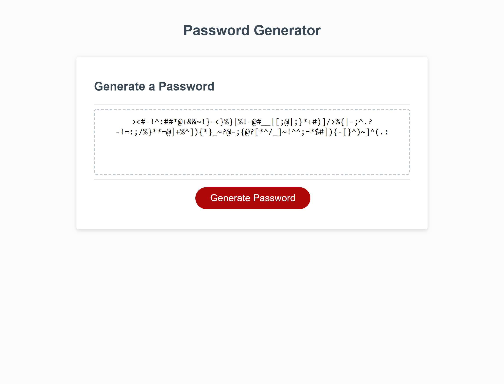

# Password-Generator

## Description 
A random passowrd generator that lets employees to generate a random password based on criteria they have selected. It provides better security and a peace of mind. It has a clean and a responsive user interface. 

## Technolgies Used
- HTML
- CSS
- JAVASCRIPT    

## Links 
- [Github Link](https://github.com/rajveer-s/Password-Generator)

- [Deployed Link](https://rajveer-s.github.io/Password-Generator/)

## Screenshot

